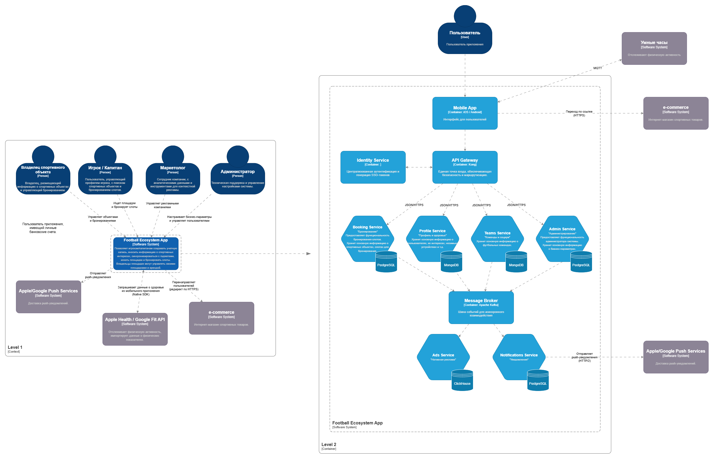

# Концептуальная архитектура

Проект концептуальной архитектуры мобильного приложения для аренды футбольных площадок.

## Содержание

1. [Введение](#1-введение)
    * [1.1 Актуальность проекта](#11-актуальность-проекта)
    * [1.2 Объект проектирования](#12-объект-проектирования)
    * [1.3 Предмет проектирования](#13-предмет-проектирования)
    * [1.4 Цели и задачи разработки](#14-цели-и-задачи-разработки)
2. [Анализ требований](#2-анализ-требований)
    * [2.1 Бизнес-цели проекта](#21-бизнес-цели-проекта)
    * [2.2 Стейкхолдеры и их интересы](#22-стейкхолдеры-и-их-интересы)
    * [2.3 Бизнес-требования (BR)](#23-бизнес-требования-br)
    * [2.4 Функциональные требования (FR)](#24-функциональные-требования-fr)
3. [Архитектурный анализ](#3-архитектурный-анализ)
    * [3.1 Атрибуты качества](#31-атрибуты-качества)
    * [3.2 Нефункциональные требования (NFR)](#32-нефункциональные-требования-nfr)
    * [3.3 Архитектурные опции и обоснование выбора](#33-архитектурные-опции-и-обоснование-выбора)
    * [3.4 Список архитектурных решений (ADR)](#34-список-архитектурных-решений-adr)
4. [Концептуальная архитектура (C4 Model)](#4-концептуальная-архитектура-c4-model)
    * [4.1 Уровень 1: Системный контекст](#41-уровень-1-системный-контекст)
    * [4.2 Уровень 2: Контейнеры и компоненты](#42-уровень-2-контейнеры-и-компоненты)
5. [Архитектурные представления](#5-архитектурные-представления)
    * [5.1 Функциональное и Информационное](#51-функциональное-и-информационное)
    * [5.2 Многозадачность (Concurrency)](#52-многозадачность-concurrency)
    * [5.3 Инфраструктура и Безопасность](#53-инфраструктура-и-безопасность)
    * [5.4 Механизм локальной синхронизации данных](#54-механизм-локальной-синхронизации-данных)
6. [Реализация и сценарии](#6-реализация-и-сценарии)
    * [6.1 Описание сценариев использования (Use Cases)](#61-описание-сценариев-использования-use-cases)
    * [6.2 Критические бизнес-сценарии](#62-критические-бизнес-сценарии)
    * [6.3 План поэтапной разработки (Roadmap)](#63-план-поэтапной-разработки-roadmap)
7. [Анализ рисков](#7-анализ-рисков)
    * [7.1 Описание рисков](#71-описание-рисков)
    * [7.2 Анализ рисков созданной архитектуры и компромиссов](#72-анализ-рисков-созданной-архитектуры-и-компромиссов)
8. [Оценка стоимости владения (TCO)](#8-оценка-стоимости-владения-tco)
9. [Заключение](#9-заключение)

---

## 1. Введение
  
### 1.1 Актуальность проекта
В рамках стратегии цифровой трансформации компания, производящая спортивные товары (одежда, обувь) и инвентарь, переходит от модели классического ритейла к формированию спортивной экосистемы. Для популяризации и продвижения своей продукции компания приняла решение о создании нового продукта — платформы для поиска и аренды спортивных объектов.  
  
Данный проект направлен на объединение пользователей в социальные группы для командных занятий спортом, что дополняет существующий ландшафт ИТ-продуктов (интернет-магазин и специализированные приложения для индивидуальных занятий).  
  
Таким образом, реализация данного проекта позволит создать единую среду для покупок, тренировок и социальной активности, что поможет освоить новые каналы для информирования покупателей о выходе новых товаров и стимулировать спрос.  
  
Архитектурное решение должно обеспечить бесшовный переход из интерфейса букинга в интернет-магазин (через диплинки) для демонстрации актуальных товаров и новинок на основе спортивных интересов пользователя. Реализация данной платформы начинается с пилотного проекта по аренде футбольных площадок. В дальнейшем система будет масштабирована на другие виды спорта (теннис, волейбол и т.д.). Существующие узкоспециализированные приложения сохраняют свою автономность.  
  
> **Глобальная бизнес-цель:** Освоить новые каналы информирования покупателей о выходе новых товаров и стимулировать вовлечённость в здоровый образ жизни через соревновательные механики.

### 1.2 Объект проектирования
Экосистема для взаимодействия игроков в футбол, включающая процессы аренды спортивных объектов, организации соревнований (лиги, турниры), мониторинга персональной физической активности и персонализированного маркетинга.

### 1.3 Предмет проектирования
Предметом проектирования является концептуальная архитектура, описывающая мобильное приложение, построенное на микросервисной архитектуре с использованием методологии DDD и обладающее высоким потенциалом для горизонтального масштабирования. Приложение проектируется как некий фундамент, позволяющий расширять географию сервиса (от локального MVP до глобального рынка) и наращивать функциональсть без перепроектирования основного ядра.  
  
> Система должна обеспечивать высокую доступность и масштабируемость для обслуживания пользователей по всему миру.  
  
### 1.4 Цели и задачи разработки
Основной целью работы является проектирование концептуальной архитектуры мобильного приложения, обеспечивающего:
*   **Социальное взаимодействие:** Формирование футбольных команд и поиск партнеров для тренировок;
*   **Аналитическую поддержку:** Сравнение спортивных достижений с прошлыми результатами и показателями других игроков;
*   **Монетизацию:** Внедрение промоакций и бесшовную интеграцию с существующим интернет-магазином компании;
*   **Безопасность:** Защита персональных данных пользователей и данных о здоровье в соответствии ФЗ-152, GDPR.

---
  
## 2. Анализ требований

### 2.1 Бизнес-цели проекта
На основе анализа интересов инвестора определены следующие приоритетные цели:
1. Увеличение конверсии в интернет-магазине через нативную рекламу на основе встроенной рекомендательной системы;
2. Создание самоподдерживающихся социальных групп по интересам для повышения лояльности и удержания пользователей;
3. Снижение стоимости привлечения новых пользователей за счет виральности и социального взаимодействия;
4. Формирование качественной базы данных об инвентаре и спортивных интересах пользователей для предиктивного маркетинга.
  
---
  
### 2.2 Стейкхолдеры и их интересы

Для проектирования системы были выделены ключевые группы стейкхолдеров.  
Понимание их интересов позволило определить границы доменов (Bounded Contexts) и приоритеты разработки.  

| Стейкхолдер | Основной интерес в системе | Ключевая цель |
|:---|:---|:---|
| **Владелец площадки** | Монетизация объекта | Сдача площадки в аренду, управление слотами, привлечение новых арендаторов. |
| **Игрок** | Персонализация и социализация | Поиск партнеров для совместной аренды, ведение личной статистики, мониторинг здоровья. |
| **Капитан команды** | Управление и логистика | Формирование состава команды, поиск и аренда площадок, организация игр. |
| **Организатор матчей** | Администрирование соревнований | Создание турнирных сеток, управление расписанием, фиксация результатов. |
| **Маркетолог/Инвестор** | Нативная реклама и продажи | Рост конверсии в интернет-магазине через анализ данных об инвентаре, интересах и нативную рекламу. |
| **Администратор** | Безопасность и контроль | Управление настройками бизнес-правил, аудит действий. |

Для ознакомления с расширенным анализом итересов стейхолдеров перейдите по [ссылке](./03-stakeholder-interests.md)

---

### 2.3 Бизнес-требования (BR)

Ниже приведен список высокоуровневых бизнес-требований, сгруппированных по ключевым направлениям развития платформы.

| ID | Категория | Описание требования |
|:---|:---|:---|
| **BR-01** | **Аренда** | Предоставить владельцам ФП инструменты публикации площадок и управления слотами. |
| **BR-02** | **Организация** | Позволить игрокам и капитанам искать и бронировать футбольные площадки для тренировок/игр. |
| **BR-03** | **Профиль** | Обеспечить ввод и храние данных об экипировке, спортивных интересах и физических показателях (через смарт-часы). |
| **BR-04** | **Социум** | Создать механизмы формирования команд для совместных тренировок и участия в турнирах. |
| **BR-05** | **Турниры** | Предоставить организаторам инструменты для проведения турниров: создания турнирных сеток и фиксации результатов. |
| **BR-06** | **Маркетинг** | Настройки контекстных рекламных кампаний на основе данных об инвентаре, интересах игроков и бесшовный переход в интернет-магазин инвестора. |
| **BR-07** | **Безопасность**| Гарантировать сохранность данных о здоровье и аудит действий с персональными данными. |

---

### 2.4 Функциональные требования (FR)

Функциональные требования описывают поведение системы для реализации указанных выше BR.  
> Трассировка гарантирует, что каждая функция обоснована бизнес-целью.

| ID ФТ | Компонент | Функциональное требование | Трассировка |
|:---|:---|:---|:---|
| **FR-BK-01** | Booking | CRUD-интерфейс управления карточкой площадки и фото. | BR-01 |
| **FR-BK-02** | Booking | Транзакционный механизм бронирования (защита от Double Booking). | BR-02, BR-07 |
| **FR-UP-01** | Profile | Анкета игрока: инвентарь, бренды, навыки и хобби. | BR-03 |
| **FR-UP-02** | Profile | Интеграция с Apple Health / Google Fit для импорта тренировок. | BR-03 |
| **FR-TM-01** | Teams | Создание карточки команды и управление ростером (инвайты/кики). | BR-04 |
| **FR-TR-01** | Tournaments| Генератор сеток (Play-off/Round Robin) и протоколы матчей. | BR-05 |
| **FR-AD-01** | Ads | Генерация Deep Links с SSO-токеном для перехода в магазин. | BR-06 |
| **FR-NT-01** | Notification| Рассылка PUSH-уведомлений о бронях и успехах друзей. | BR-02, BR-04 |
| **FR-ADM-01**| Admin | Инструменты модерации контента и конфигурация лимитов отмены. | BR-07 |

---

## 3. Архитектурный анализ

### 3.1 Атрибуты качества

Для обеспечения жизнеспособности платформы и удовлетворения интересов инвестора были выделены три основных атрибута качества:

* **Согласованность (Consistency):** *Система должна исключать двойное бронирование (Double Booking) и гаранттировать целостность данных при конкурентном доступе.*
* **Доступность (Availability):** *Система должна быть доступна 24/7 (SLA 99.9%), так как пользователи принимают решения о тренировках спонтанно.*
* **Модифицируемость (Modifiability):** *Архитектура должна позволять внедрять новые модули (например, "Турниры") без переписывания существующих сервисов.*

---

### 3.2 Нефункциональные требования (NFR)
* **Производительность:** *Время отклика API Gateway (p95) < 200 мс.*
* **Надежность:** *Коэффициент доступности системы (SLA) 99.9%*
* **Доступность:** *Система должна обеспечивать работоспособность ключевых функций мобильного клиента (просмотр расписания, доступ к профилю) в режиме Offline-first для минимизации простоев при отсутствии связи*
* **Автономность**: *Мобильное приложение должно поддерживать сбор и локальное хранение данных от носимых устройств (через Health-сервисы) и возможность формирования отложенных заявок на бронирование без доступа к сети*
* **Целостность данных:** *Механизм синхронизации должен гарантировать идемпотентность операций (исключение дублей при повторных попытках) и корректное разрешение конфликтов (Conflict Resolution) при выгрузке накопленных в офлайне данных*
* **Емкость:** *Поддержка до 100 000 одновременно активных соединений (WebSockets) для пушей*
* **Compliance:** *Соответствие ФЗ-152 и GDPR в части хранения ПД*

---

### 3.3 Архитектурные опции и обоснование выбора

При выборе архитектурного стиля проводилось сравнение монолитного и микросервисного подходов.

| Критерий | Монолитная архитектура | Микросервисная архитектура (DDD) |
|:---|:---|:---|
| **Скорость запуска (Time-to-Market)** | Высокая на начальном этапе (упрощенная разработка и развертывание). | Средняя (требует предварительной настройки инфраструктуры, CI/CD и шины событий). |
| **Масштабируемость** | Преимущественно вертикальная (ограничена ресурсами одного узла). | Горизонтальная (независимое масштабирование отдельных сервисов под нагрузкой). |
| **Отказоустойчивость** | Низкая (единая точка отказа: сбой в одном модуле может привести к неработоспособности всей системы). | Высокая (изоляция отказов: сбой в одном сервисе не блокирует работу остальных доменов). |
| **Сложность данных** | Единая база данных (риск высокой связанности и сложности внесения изменений). | Polyglot Persistence (оптимизация хранилищ под специфику каждого бизнес-домена). |

**Обоснование выбора:**  
Для реализации системы выбрана микросервисная архитектура, реализованная по принципам Domain-Driven Design (DDD).  
  
Данное решение обусловлено следующими факторами:
* Разделение зон ответственности: Домены «Маркетинг» (Ads Service) и «Бронирование» (Booking Service) имеют разные жизненные циклы и требования к изменениям. Микросервисы позволят командам развивать эти модули независимо, исключив конфликты при релизах;
* Горизонтальное масштабирование: Учитывая планы по выходу на глобальный рынок, система должна выдерживать пиковые нагрузки на сервис бронирования, не увеличивая при этом затраты на инфраструктуру менее нагруженных узлов;
* Технологическая гибкость: Использование Kafka как связующего звена позволяет внедрить событийно-ориентированную модель (Event-Driven). Это обеспечивает асинхронную обработку данных и гарантирует сохранность заявок даже при кратковременных сбоях в отдельных сервисах;
* Снижение технического долга: Изоляция данных в рамках каждого домена предотвращает появление неявных зависимостей, что упрощает долгосрочную поддержку и миграцию отдельных частей системы.

---

## 3.4 Список архитектурных решений (ADR)

В данном разделе зафиксированы ключевые проектные решения, определившие облик системы. Каждое решение принято на основе анализа бизнес-целей и атрибутов качества.

| № | Решение | Контекст и Обоснование |
|:---|:---|:---|
| **1** | **Микросервисная архитектура (DDD)** | Необходимость независимого масштабирования доменов (Бронирование vs Аналитика) и параллельная разработка независимыми командами. |
| **2** | **Event-Driven взаимодействие (Kafka)** | Требование слабой связности (Decoupling) между сервисом бронирования и системой "контекстной рекламы". |
| **3** | **Optimistic Locking (Versioning)** | Исключение избыточного бронирования при сохранении высокой доступности (Availability). Требуется для поддержки Offline-сценариев и горизонтального масштабирования БД. |
| **4** | **JWT + Deep Linking (SSO)** | Бизнес-требование по интеграции с экосистемой. Передача Short-lived токенов обеспечивает безопасность и UX. |

---

#### Детальное описание ключевого решения (Пример ADR-1)

**Заголовок:** Переход на микросервисную архитектуру на основе принципов DDD.

**Контекст:** Система совмещает интенсивную транзакционную нагрузку (OLTP) в модуле бронирования и ресурсоемкую аналитическую обработку (OLAP) для рекламного движка. Монолитная архитектура ограничивает масштабируемость отдельных компонентов и препятствует оперативной реализации социальных функций из-за высокой связности кода.

**Решение:** Декомпозиция системы на отдельные функциональные домены (Bounded Contexts). Каждый сервис обладает собственной изолированной базой данных и взаимодействует с другими компонентами через событийную шину.

**Последствия:**
*   **Положительные:** Возможность независимого развертывания (deployment), локализация отказов в рамках одного домена, оптимизация стека технологий под задачи конкретного сервиса.
*   **Отрицательные:** Повышение сложности инфраструктурной поддержки, необходимость реализации механизмов обеспечения распределенной согласованности данных (паттерн Saga).

---

## 4. Концептуальная архитектура (C4 Model)

Для проектирования системы использована методология **C4 Model**

### 4.1 Уровень 1: Системный контекст

На данном уровне показано взаимодействие системы «Football Ecosystem» с внешними пользователями и окружением компании.

**Ключевые взаимодействия:**
*   **Стейкхолдеры:** Взаимодействуют с системой через единое мобильное приложение.
*   **Магазин инвестора:** Принимает пользователей через Deep Links для совершения покупок.
*   **Фитнес-сервисы (Apple/Google):** Поставляют данные о физической активности.
*   **Уведомления (FCM/Email):** Внешние шлюзы для доставки сообщений пользователям.

---

### 4.2 Уровень 2: Контейнеры и компоненты

Здесь раскрывается внутренняя структура системы: распределение логики по микросервисам и выбор хранилищ данных.

**Технологический стек и интеграция:**
*   **API Gateway (Kong):** Единая точка входа, обеспечивающая безопасность и маршрутизацию.
*   **Message Broker (Apache Kafka):** Шина событий для асинхронного взаимодействия (например, передача данных из *Profile* в *Ads*).
*   **Database per Service:** 
    *   **PostgreSQL:** Транзакционные данные (Booking, Tournaments).
    *   **MongoDB:** Социальные связи и гибкие профили (Teams, Profile).
    *   **ClickHouse:** Аналитика и рекламные метрики (Ads). //На этапе MVP Redis
*   **Identity Service:** Централизованная аутентификация и генерация SSO-токенов.

> Данный раздел описывает **концептуальную архитектуру** и границы домена. Выбор конкретных библиотек, структур данных и алгоритмов реализации (Implementation Details) делегируется **команде разработки**, которая обязана обеспечить выполнение описанных бизнес-сценариев, включая обработку пограничных состояний и альтернатиных сценариев, а так же отказоустойчивость и идемпотентность операций в распределенной среде.
  
---

## 5. Архитектурные представления

### 5.1 Функциональное и Информационное
Данное представление описывает логическую структуру системы и стратегию управления данными.

*   **Декомпозиция:** Система разделена на 7 микросервисов на базе бизнес-доменов. API Gateway (Kong) изолирует внутреннюю сеть и управляет сквозной авторизацией.
*   **Стратегия данных (Polyglot Persistence):**
    *   **PostgreSQL:** Используется в сервисах *Booking*, *Admin* и *Notification* для обеспечения ACID-свойств в критических операциях.
    *   **MongoDB:** Выбрана для сервисов *Profile* и *Teams* благодаря гибкости схемы данных (Social Graph, инвентарь).
    *   **ClickHouse:** Применяется в *Ads Service* для высокоскоростной обработки логов и аналитики рекламных переходов. //Не входит в скоуп MVP

---

### 5.2 Многозадачность (Concurrency)
Описание механизмов обработки параллельных запросов и обеспечения целостности.

*   **Конкурентный доступ:** Для предотвращения Double Booking в домене Booking реализован механизм Optimistic Locking на основе версионирования записей. При попытке записи система проверяет соответствие версии данных в запросе и в БД. Это позволяет избежать «зависания» транзакций, характерного для пессимистичных блокировок, и обеспечивает отзывчивость UI в распределенной среде.
*   **Асинхронность:** Тяжелые процессы (рассылка уведомлений, расчет статистики, агрегация данных для рекламы) вынесены в фоновые задачи через **Apache Kafka**. Это гарантирует, что задержки внешних систем (например, Apple Health) не влияют на отзывчивость UI.
*   **Масштабирование:** Каждый контейнер микросервиса является stateless, что позволяет горизонтально масштабировать систему под нагрузкой.

---

### 5.3 Инфраструктура и Безопасность
Описание физического развертывания и защиты системы.

*   **Deployment:** 
    *   Система спроектирована как Cloud-native решение, развернутое в изолированном сетевом контуре;
    *   **Kubernetes (K8s)** для автоматического масштабирования под нагрузку;
    *   Автоматизированные пайплайны сборки и деплоя для каждого сервиса.
*   **Security:**
    *   **Identity:** Использование стандарта **OAuth 2.0 / OpenID Connect**;
    *   **Traffic:** Весь обмен данными защищен **TLS 1.3**;
    *   **Data Protection:** Персональные данные и показатели здоровья шифруются алгоритмом **AES-256**;
    *   **SSO (Deep Links):** Реализована безопасная передача кратковременных токенов доступа для бесшовного перехода в интернет-магазин.
* **Observability:**
    * Стек Prometheus + Grafana для контроля здоровья инфраструктуры и очередей Kafka;
    * Внедрение Distributed Tracing (Jaeger) для анализа задержек в распределенных запросах.
  
*Рекламные переходы формируются на стороне бэкенда (Ads Service) в момент запроса. Это позволяет внедрять в Deep Link динамические параметры (Short-lived токен доступа) и централизованно управлять целевыми URL без обновления клиентского приложения.*

Архитектурный вывод:
* Выбранная микросервисная модель в сочетании с Kafka напрямую адресует атрибут модифицируемости (через слабую связность), а использование PostgreSQL с блокировками гарантирует атрибут согласованности в критических бизнес-сценариях;
* Для обеспечения бесшовности и безопасности используется взаимодействие на уровне API Gateway обеих систем. Мобильное приложение инициирует переход через защищенный Deep Link, а валидация прав доступа происходит по каналу Server-to-Server между шлюзами приложений.

### 5.4 Механизм локальной синхронизации данных

**Стратегия Offline-first и локальная синхронизация данных**

1. **Локальное хранение (Data Persistence)**  
   Мобильное приложение использует локальную БД (**Room** для Android / **CoreData** для iOS) для кэширования критически важных данных.
   * **Объекты кэширования:** Профиль игрока, список ближайших бронирований, карточки команд и сохраненные «избранные» площадки.
   * **Цель:** Обеспечение возможности пользователю просмотреть время и адрес матча, даже если интернет-соединение пропало по дороге на поле.

2. **Синхронизация и Background Sync**  
   Приложение выступает шлюзом для данных с носимых устройств (Bluetooth Gateway). В отсутствие интернета данные накапливаются локально и отправляются на сервер автоматически при восстановлении связи с помощью фоновых задач (**Background Sync**).
   * **Идемпотентность:** Для исключения дубликатов при повторных попытках отправки каждый пакет данных (тренировка, событие) помечается уникальным `Client-Side UUID`. Если сервис-приемник видит уже существующий UUID, повторная запись игнорируется.
   * **Retry Policy:** Применяется стратегия **Exponential Backoff** (повторы с экспоненциальной задержкой) для защиты бэкенда от лавинообразных запросов при массовом восстановлении связи у пользователей на стадионе.

3. **Конфликт-менеджмент и Optimistic Locking**  
   В доменах `Booking` и `Profile` внедрена **оптимистичная блокировка** (версионирование записей).
   * Это позволяет отказаться от тяжелых `Pessimistic Locking (SELECT FOR UPDATE)`, которые создают узкие места при масштабировании на несколько регионов и блокируют UI при плохой связи.
   * При выходе из офлайна сервер проверяет версию записи; если за время отсутствия сети данные были изменены другим пользователем (конфликт), сервер отклоняет запрос, предотвращая порчу данных.

4. **Оптимистичный UI (Optimistic UI)**  
   Для некоторых действий (например, изменение состава команды в Team Service или обновление данных профиля) приложение мгновенно отображает изменения в интерфейсе, не дожидаясь ответа сервера.
   * Синхронизация проводится в фоновом режиме через **Background Sync**.
   * В случае ошибки синхронизации (конфликт версий) приложение выполняет откат (Rollback) локального состояния и уведомляет пользователя о необходимости актуализировать данные.

---

## 6. Реализация и сценарии

### 6.1 Описание сценариев использования (Use Cases)

Ниже приведены сценарии использования, описывающие сквозное взаимодействие функциональных блоков системы (микросервисов) через синхронные вызовы и шину событий Kafka.

#### **UC-1: Организация игры/тренировки капитаном**
Сценарий описывает процесс бронирования и автоматической инициации сбора состава команды через push-уведомления.

**Действие:** 
1. Капитан ищет и резервирует свободный слот через **Booking Service**;
2. **Booking Service** сохраняет бронь в своей БД и публикует событие `slotReseved` в **Kafka** (topic: `bookings`, payload события содержит: ID слота, ID капитана, время, место);
3. **Team Service** подписан на топик `bookings`, считывает сообщение, обрабатывает данные и определяет состав игроков которых нужно уведомить;
4. **Team Service** публикует обогащенное событие `PlayersNotificationRequested` в **Kafka** (topic: `notifications`, payload содержит: список ID игроков, текст сообщения, параметры перехода в приложение);
5. **Notification Service** подписн на топик `notifications`, считывает сообщение, обрабатывает его и рассылает push-уведомления с текстом сообщения игрокам из списка через Firebase/APNS.

**Результат:** Площадка забронирована, определен список участников, целевая аудитория оповещена о предстоящей игре/тренировке.

---

#### **UC-2: Персонализированное предложение (Маркетинг)**
Сценарий реализации интереса инвестора через анализ профиля.

**Действие:** 
1. Игрок обновляет данные в профиле о своих спортивных интересах, инвентаре в **Profile Service**;
2. **Profile Service** сохраняет данные в своей БД и публикует событие `profileUpdated` в **Kafka** (topic: `userProfiles`);
3. **Ads Service** подписан на топик `userProfiles`, считывает сообщение, обновляет локальную проекцию интересов пользователя и запускает **Matching Engine**;
4. **Ads Service** сопоставляет интересы игрока с активными офферами маркетолога и сохраняет в своей БД персональный "пре-оффер";
5. При следующем запуске приложения мобильный клиент запрашивает актуальный баннер у **Ads Service** (через API Gateway);
6. **Ads Service** отдает динамический баннер с Deep Link, содержащим ID товара и идентификатор рекламной кампании;
7. Клик по баннеру инициирует запрос к **Identity Service** (через API Gateway) для генерации временного SSO-токена (JWT);
8. Пользователь бесшовно переходит во внешнюю систему (магазин инвестора) с этим токеном.
 
*Ads Service хранит у себя минимально необходимый слепок данных о пользователях для быстрой выдачи баннеров*

**Результат:** Нативная продажа товара на основе актуальных данных игрока.

---

#### **UC-3: Организация и проведение турнира**

**Акторы:** Оганизатор, Капитан команды

**Предусловия:**
* Организатор имеет права на создание событий в Tournament Service;
* Команды зарегистрированы в системе через Team Service.

**Основной поток:**

1. Организатор публикует турнир (Название, формат, количество мест) в **Tournament Service**;
2. **Tournament Service** сохраняет данные в своей БД и публикует событие `tournamentCreated` в **Kafka** (topic: `tournaments`, payload: ID турнира, вид спорта, город, дата начала, дедлайн для заявок);
3. **Notification Service** подписан на топик `tournaments` и слушает событие tournamentCreated, получает это событие, делает выборку целевой аудитории (капитаны команд) и отправляет им Push-уведомление;
4. Капитан, кликнув на уведомление, переходит в приложение (через Deep Linking на конкнетную страницу турнира);
5. Капитан подает заявку, **Team Service* валидирует состав (ростер) и публикует событие `applicationSubmitted` в **Kafka**;
6. Организатор в **Tournament Service** видит список заявок и одобряет/отклоняет каждую заявку. **Tournament Service** публикует событие applicationStatusChanged;
7. **Notification Service** подписан на это событие, формирует и отправляет капитану Push-уведомление: «Ваша заявка принята» (или «Отклонена»);
8. Организатор (после окончания набора команд) формирует сетку в **Tournament Service**;
9. Для каждой пары участников организатор бронирует в **Booking Service** спортивную площадку;
10. **Booking Service** резервирует слот и публикует событие `slotReserved` (в контексте идентификатор турнира, матча)
11. **Tournament Service**, получив событие slotReserved, фиксирует место в сетке и публикует финальное событие matchConfirmed;
12. Notification Service считывает MatchConfirmed и рассылает игрокам уведомления с точным адресом и временем.
13. По завершении матча организатор вносит счет в **Tournament Service**, который автоматически обновляет сетку;
14. Система через **Kafka** и **Notification Service** уведомляет следующих участников о времени и месте их матча.

*Реализация **Tournament Service** не входит в скоуп MVP*  
***Notification Service** может быть умным. Вместо того чтобы спамить всем, он может спросить у **Profile Service** (через API Gateway или кэш), кто из игроков является капитаном и живет в нужном регионе.*

**Результат:** Полная автоматизация турнирного цикла и информирование участников.

---

### 6.2 Критические бизнес-сценарии
Ниже описаны ключевые цепочки взаимодействий, которые определяют успех платформы.

1. **UC-1: Организация матча и сбор состава.**

   **Акторы:** Капитан команды/Игрок  
  
   **Предусловия:**
      * Пользователь авторизован в системе;
      * Владелец площадки создал расписание с достумными слотами и максимальным количеством игроков (max_players);
      * Для каждой площадки указано максимальное количество игроков (аналогично количеству товара корзине с проверкой остатка товара на складе в e-commerce).
  
   **Основной поток (Сборная игра):**
      * Игрок выбирает площадку и видит доступные временные слоты;
      * Система отображает количество свободных мест в слоте;
      * Игрок нажимает кнопку "Записаться";
      * Система уменьшает количество доступных мест в слоте на величину брони;
      * Если количество свободных мест становится равным 0, система переводит слот в статус «Забронировано» и скрывает кнопку "Записаться".
  
   **Альтернативный поток (Командная бронь):**
      * Игрок выбирает площадку и видит доступные временные слоты;
      * Система отображает количество свободных мест в слоте;
      * Капитан команды нажимает "Записаться";
      * Система проверяет max_players - current_players =  max_players;
      * Если условие выполняется, Система уменьшает количество доступных мест в слоте =  max_players;
      * система переводит слот в статус «Забронировано» и скрывает кнопку "Записаться".
      * **Booking Service** отправляет событие в **Kafka** → **Team Service** определяет состав игроков → **Notification Service** рассылает push-уведомления этим игрокам.

2. **UC-2: Персонализированное предложение и покупка.**

   **Акторы:** Игрок/Маркетолог

   **Предусловия:**
   * Игрок заполнил в профиле разделы «Инвентарь» и «Спортивные интересы»;
   * Маркетолог настроил в системе рекламные кампании.

   **Основной поток:**
   * Игрок вносит изменения в свой профиль в **Profile Service**;
   * **Profile Service** передает данные в **Ads Service** через брокер сообщений **Kafka**;
   * **Ads Service** фиксирует обновленные данные профиля и сопоставляет их с активными рекламными кампаниями;
   * При следующем запуске мобильное приложение запрашивает актуальный рекламный оффер у **Ads Service**;
   * **Ads Service** возвращает персонализированный динамический баннер с Deep Link;
   * При клике на баннер Система инициирует генерацию SSO-токена в **Identity Service**;
   * Пользователь бесшовно перенаправляется на внешний ресурс (интернет-магазин) с автоматической авторизацией по токену.

---

### 6.3 План поэтапной разработки (Roadmap)

Для минимизации рисков проект разделен на три фазы:

#### **Фаза 1: Основа (MVP)**
* **Цель:** Запуск основного цикла аренды.
* **Сервисы:** `Auth`, `Booking`, `Profile` (Core).
* **Результат:** Возможность найти и забронировать поле.

#### **Фаза 2: Экосистема и Монетизация**
* **Цель:** Подключение аналитики и рекламного движка.
* **Сервисы:** `Ads Service`, `Social/Team`, Интеграция с Kafka.
* **Результат:** Нативная реклама и формирование команд.

#### **Фаза 3: Масштабирование**
* **Цель:** Глобальный запуск и турниры.
* **Сервисы:** `Tournament Service`, `Admin/Moderation`, Аналитическое хранилище.
* **Результат:** Полноценная спортивная соцсеть.

---

## 7. Анализ рисков

### 7.1 Описание рисков

**Бизнес-риски:**
  
* Privacy Compliance: Нарушение законодательства (ФЗ-152) при хранении данных о здоровье;
* User Adoption: Низкое заполнение профилей игроками.

**Стратегия минимизации:**
* Шифрование чувствительных данных (AES-256) и строгий аудит доступа.
* Геймификация и предоставление эксклюзивных скидок за подключение фитнес-трекеров.

**Технические риски**

* Data Consistency: Риск рассогласованности данных в распределенной среде;
* Operational Complexity: Сложность эксплуатации 7+ микросервисов и управления 7+ базами данных, брокером сообщений и K8s.
* Integration Failure: Сложность интеграции с внешними API 

**Стратегия минимизации:**
* Использование паттерна Saga для сложных операций и Outbox Pattern для Kafka;
* Контейнеризация (Docker) и использование управляемых облачных сервисов (Managed Services);
* Использование паттерна Circuit Breaker для изоляции отказов.

### 7.2 Анализ рисков созданной архитектуры и компромиссов
Данный пункт отражен в описании принятых решений и стратегий минимизации.

**Компромиссы (Trade-offs):**
* Масштабируемость vs Сложность данных: Мы выбрали независимое масштабирование микросервисов (раздел 3.3). Жертвуем скоростью запуска (Time-to-Market), ACID-транзакциями ради масштабируемости и отказоустойчивости;
* Гибкость разработки vs Стоимость владения: Каждый сервис имеет свою БД (PostgreSQL, MongoDB), что дает лучшую модель данных для каждой задачи;
* Отказоустойчивость vs Задержки (Latency): Асинхронное взаимодействие через брокер сообщений повышает доступность системы;
* Consistency vs Availability: В домене бронирования выбран приоритет доступности (Availability) и масштабируемости. Вместо Pessimistic Locking, ограничивающего работу в офлайне и создающего очереди на уровне БД, внедрена Optimistic Locking. Мы допускаем редкие конфликты при синхронизации из офлайна, которые разрешаются на уровне приложения, ради бесперебойной работы системы в условиях нестабильной сети;
* Отказ от онлайн-оплаты в пользу оплаты на месте (наличные, СБП) для ускорения выхода на рынок (Time-to-Market);
* Мы жертвуем оперативной актуальностью данных в пользу гарантированной локальной синхронизации данных;
* Мы сознательно отказались от Pessimistic Locking (SELECT FOR UPDATE). Хотя он исключает конфликты, он плохо масштабируется на распределенные регионы и блокирует UI при плохой связи. Переход на Optimistic Locking — это компромисс в пользу высокой доступности (Availability) и масштабируемости системы при глобальном росте.

**Риски:**
* Распределенная несогласованность данных (Data Inconsistency);
* Повышенные требования к квалификации DevOps и затраты на облачные ресурсы;
* Задержки в обновлении информации в интерфейсе пользователя (Eventual Consistency);
* Расхождение во времени (Clock Drift) и задержка аналитики;
* Конфликты при синхронизации бронирований, оформленных офлайн. //Из-за использования Optimistic Locking возможна ситуация, когда забронированный в офлайне слот уже занят другим пользователем.

**Минимизация рисков:**
Для каждого риска предложена конкретная архитектурная стратегия:
* Использование паттернов Saga и Transactional Outbox для решения проблем консистентности или AES-256 для защиты данных;
* Стандартизация CI/CD пайплайнов и использование контейнеризации;
* Оптимизация работы потребителей (consumers) и использование WebSocket для оперативных уведомлений;
* Использование серверного времени как эталонного при обработке очередей и внедрение валидации "актуальности" данных;
* Применение стратегии First-Write-Wins. Сервер отклоняет запоздалую синхронизацию, а мобильный клиент уведомляет пользователя о необходимости выбрать другое время.

---

## 8. Оценка стоимости владения (TCO)

Прогноз совокупной стоимости владения инфраструктурой при масштабировании системы.

| Период | Нагрузка (Users) | Инфраструктурные компоненты | Прогноз затрат |
|:---|:---|:---|:---|
| **Год 1 (MVP)** | до 10 000 | Базовые инстансы БД, API Gateway, Single Kafka node. | Минимальные (от $300/мес) |
| **Год 2 (Рост)** | до 100 000 | Кластеры K8s, Kafka, репликация БД, расширенное S3 хранилище. | Средние (от $1200/мес) |
| **Год 5 (Пик)** | 1 000 000+ | Auto-scaling, ClickHouse Cluster, гео-распределенные узлы. | Enterprise (от $4500/мес) |

---

## 9. Заключение

Разработанная архитектура системы **«Football Ecosystem»** полностью соответствует заявленным бизнес-целям.  

Применение принципов **Domain-Driven Design** и микросервисного подхода позволило:
1. Изолировать критический домен бронирования от аналитического модуля с нативной рекламой;
2. Обеспечить бесшовный пользовательский опыт, связывающий спорт и ритейл;
3. Заложить фундамент для глобального масштабирования социальной платформы за счет событийной модели и микросервисной архитектуры.

Система готова к поэтапной реализации, начиная с MVP-модуля аренды спортивных площадок.

